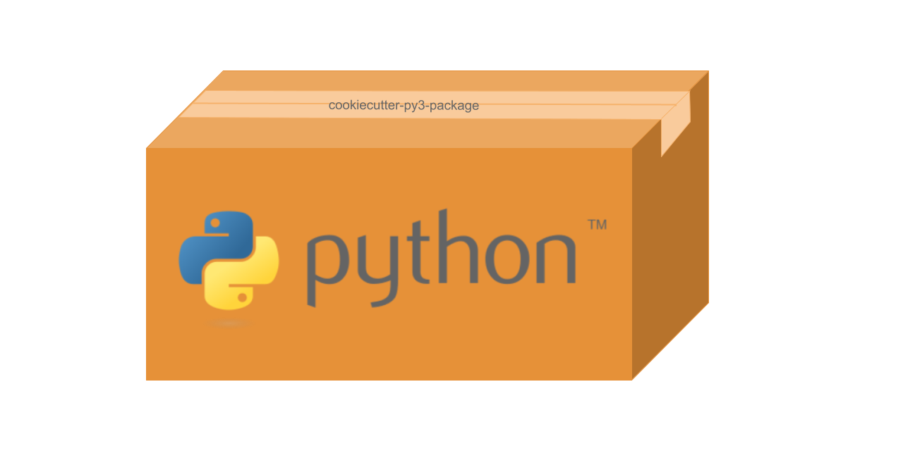

============================
**Cookiecutter Py3-Package**
============================

|

|

**A fork of** cookiecutter-pypackage_

**Currently, this is being updated to meet my specific needs, and perhaps yours.**

**Checkout the** CHANGELOG_ **to see what has been done so far.**

**Checkout the** Projects_ **page to see what is planned.**

**We are aiming for Continuos Deployment, and Keeping it simple.**

.. .. image:: https://pyup.io/repos/github/audreyfeldroy/cookiecutter-pypackage/shield.svg
..     :target: https://pyup.io/repos/github/audreyfeldroy/cookiecutter-pypackage/
..     :alt: Updates

.. .. image:: https://travis-ci.org/audreyfeldroy/cookiecutter-pypackage.svg?branch=master
..     :target: https://travis-ci.org/github/audreyfeldroy/cookiecutter-pypackage
..     :alt: Build Status

.. image:: https://app.codacy.com/project/badge/Grade/4c115acc2b3d4d13b998cdcbdb3cea64
    :target: https://www.codacy.com/gh/imAsparky/cookiecutter-py3-package/dashboard?utm_source=github.com&amp;utm_medium=referral&amp;utm_content=imAsparky/cookiecutter-py3-package&amp;utm_campaign=Badge_Grade
    :alt: Code Quality

.. image:: https://readthedocs.org/projects/cookiecutter-py3-package/badge/?version=latest
    :target: https://cookiecutter-py3-package.readthedocs.io/en/latest/?badge=latest
    :alt: Documentation Status

Cookiecutter_ template for a Python package.

* GitHub repo: https://github.com/imAsparky/cookiecutter-py3-package/
* Documentation: https://cookiecutter-py3-package.readthedocs.io/
* Free software: BSD license

**The information below relates to the original package and has not been
updated yet**

**Notable Fork changes from the Original project so far.**

#. Links from the original fork have been updated to point to this repository.
#. Support for Travis has been removed.
#. Stale Similar Cookiecutter Templates have been removed.

Features
--------

* Testing setup with ``unittest`` and ``python setup.py test`` or ``pytest``
* Tox_ testing: Setup to easily test for Python 3.6, 3.7, 3.8
* Sphinx_ docs: Documentation ready for generation with, for example, `Read the Docs`_
* bump2version_: Pre-configured version bumping with a single command
* Auto-release to PyPI_ when you push a new tag to master (optional)
* Use commit tags to release to Test-PyPi_. Coming soon.
* Command line interface using Click (optional)

.. _Cookiecutter: https://github.com/cookiecutter/cookiecutter
.. _cookiecutter-pypackage: https://github.com/audreyfeldroy/cookiecutter-pypackage
.. _Projects: https://github.com/imAsparky/cookiecutter-py3-package/projects
.. _CHANGELOG: https://github.com/imAsparky/cookiecutter-py3-package/blob/main/CHANGELOG.md
.. _Test-PyPi: https://test.pypi.org/

.. Build Status
.. -------------

Linux:

.. .. image:: https://img.shields.io/travis/audreyfeldroy/cookiecutter-pypackage.svg
..     :target: https://travis-ci.org/audreyfeldroy/cookiecutter-pypackage
..     :alt: Linux build status on Travis CI

.. Windows:

.. .. image:: https://ci.appveyor.com/api/projects/status/github/audreyr/cookiecutter-pypackage?branch=master&svg=true
..     :target: https://ci.appveyor.com/project/audreyr/cookiecutter-pypackage/branch/master
..     :alt: Windows build status on Appveyor

Quickstart
----------

Install the latest Cookiecutter if you haven't installed it yet (this requires
Cookiecutter 1.4.0 or higher)::

    pip install -U cookiecutter

Generate a Python package project::

    cookiecutter https://github.com/imAsparky/cookiecutter-py3-package.git

Then:

* Create a repo and put it there.
    This project will be aimed towards Github with use of Github Actions.
* Install the dev requirements into a virtualenv. (``pip install -r requirements_dev.txt``)
* Register_ your project with PyPI.
* Add the repo to your `Read the Docs`_ account + turn on the Read the Docs service hook.
* Release your package by pushing a new tag to main.
* Add a ``requirements.txt`` file that specifies the packages you will need for
  your project and their versions. For more info see the `pip docs for requirements files`_.
* Activate your project on `pyup.io`_.

.. _`pip docs for requirements files`: https://pip.pypa.io/en/stable/user_guide/#requirements-files
.. _Register: https://packaging.python.org/tutorials/packaging-projects/#uploading-the-distribution-archives

For more details, see the `cookiecutter-pypackage tutorial`_.

.. _`cookiecutter-pypackage tutorial`: https://cookiecutter-py3-package.readthedocs.io/en/latest/tutorial.html

Not Exactly What You Want?
--------------------------

Don't worry, you have options:

Similar Cookiecutter Templates
~~~~~~~~~~~~~~~~~~~~~~~~~~~~~~

* `ardydedase/cookiecutter-pypackage`_: A fork with separate requirements files rather than a requirements list in the ``setup.py`` file.

* `briggySmalls/cookiecutter-pypackage`_: A fork using Poetry_ for neat package management and deployment, with linting, formatting, no makefiles and more.

* `zillionare/cookiecutter-pypackage`_: A template containing Poetry_, Mkdocs_, Github CI and many more. It's a template and a package also (can be installed with `pip`)

* Also see the `network`_ and `family tree`_ for the original repo. (If you find
  anything that should be listed here, please add it and send a pull request!)

Fork This / Create Your Own
~~~~~~~~~~~~~~~~~~~~~~~~~~~

If you have differences in your preferred setup, I encourage you to fork this
to create your own version. Or create your own; it doesn't strictly have to
be a fork.

* Once you have your own version working, add it to the Similar Cookiecutter
  Templates list above with a brief description.

* It's up to you whether or not to rename your fork/own version. Do whatever
  you think sounds good.

Or Submit a Pull Request
~~~~~~~~~~~~~~~~~~~~~~~~

I also accept pull requests on this, if they're small, atomic, and if they
make my own packaging experience better.

.. _Tox: http://testrun.org/tox/
.. _Sphinx: http://sphinx-doc.org/
.. _Read the Docs: https://readthedocs.io/
.. _`pyup.io`: https://pyup.io/
.. _bump2version: https://github.com/c4urself/bump2version
.. _Punch: https://github.com/lgiordani/punch
.. _Poetry: https://python-poetry.org/
.. _PyPi: https://pypi.python.org/pypi
.. _Mkdocs: https://pypi.org/project/mkdocs/

.. _`ardydedase/cookiecutter-pypackage`: https://github.com/ardydedase/cookiecutter-pypackage
.. _`briggySmalls/cookiecutter-pypackage`: https://github.com/briggySmalls/cookiecutter-pypackage
.. _`zillionare/cookiecutter-pypackage`: https://zillionare.github.io/cookiecutter-pypackage/
.. _`network`: https://github.com/audreyr/cookiecutter-pypackage/network
.. _`family tree`: https://github.com/audreyr/cookiecutter-pypackage/network/members
