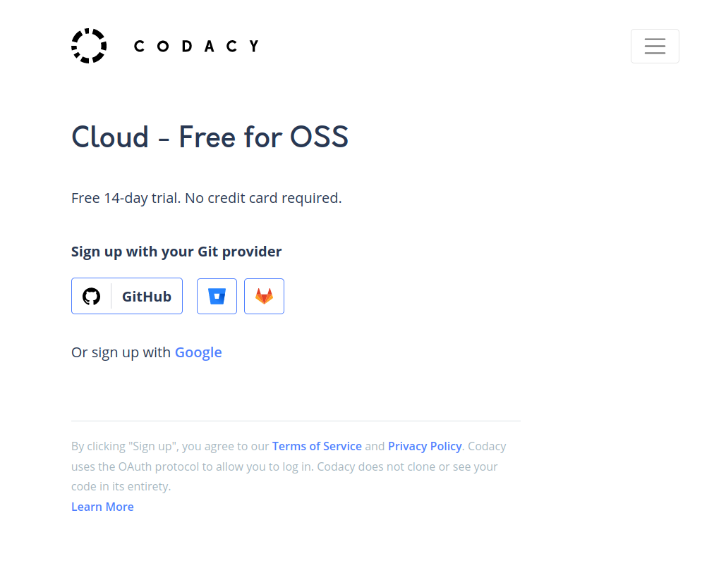
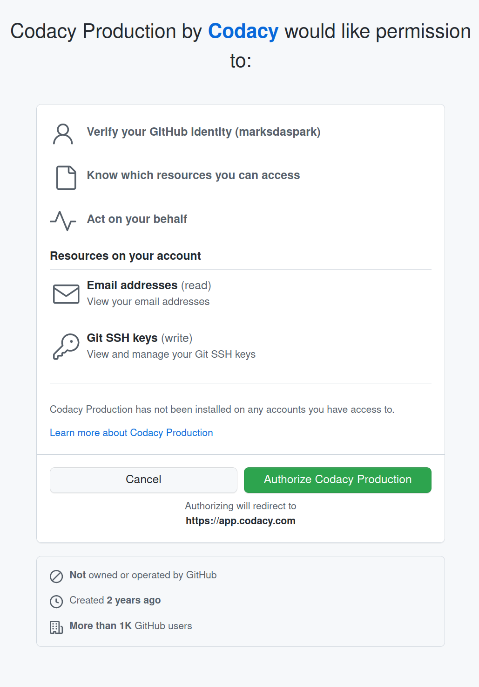
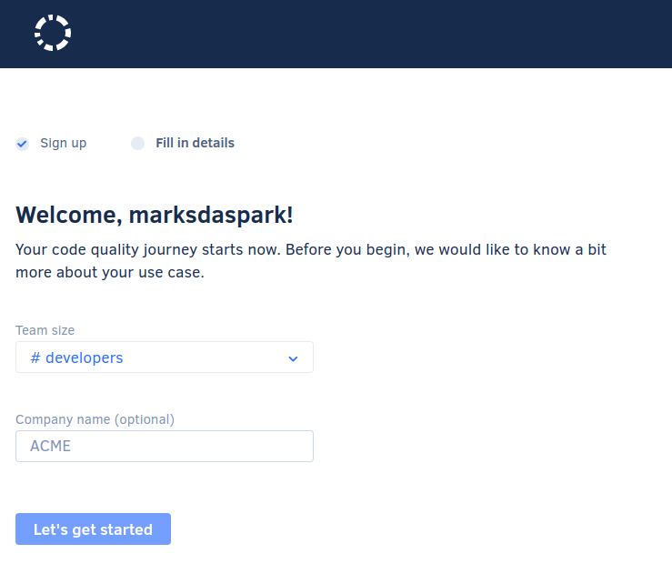
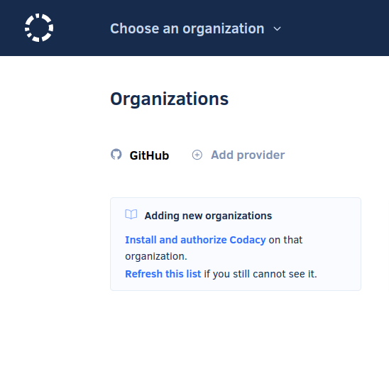
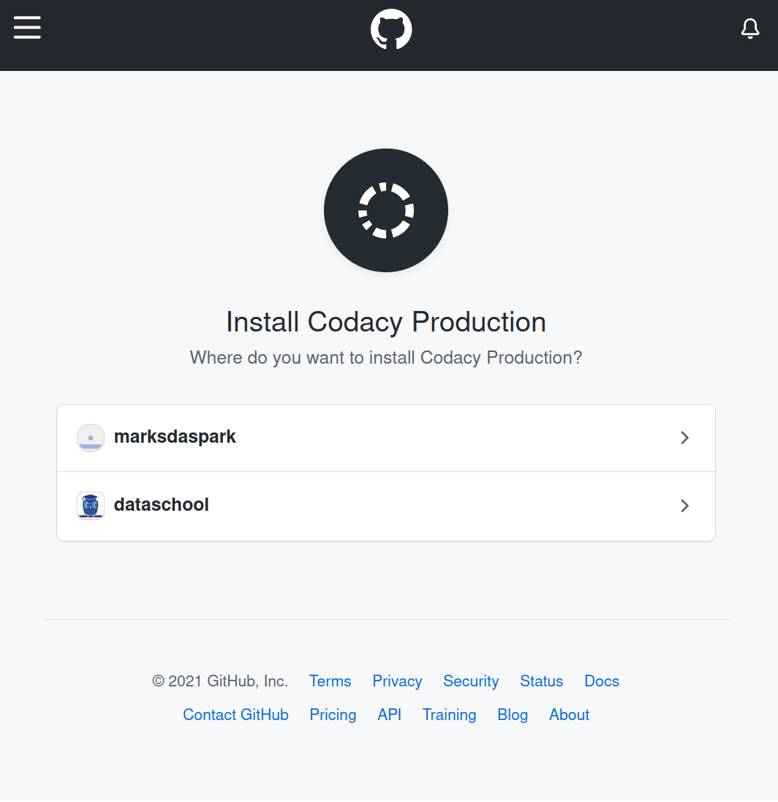
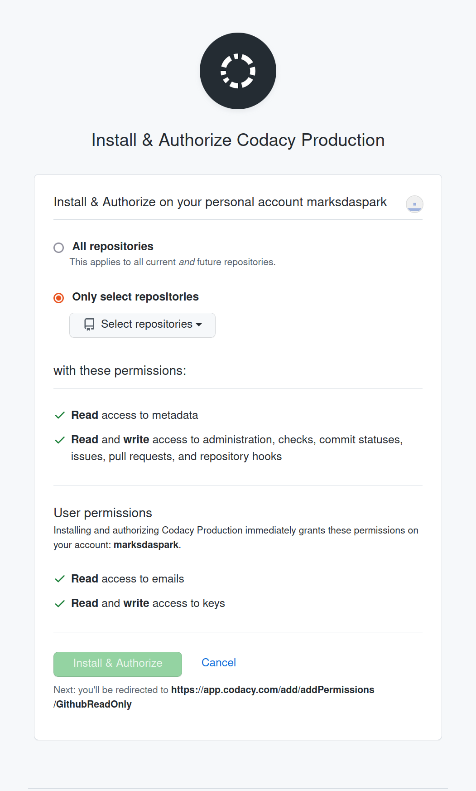
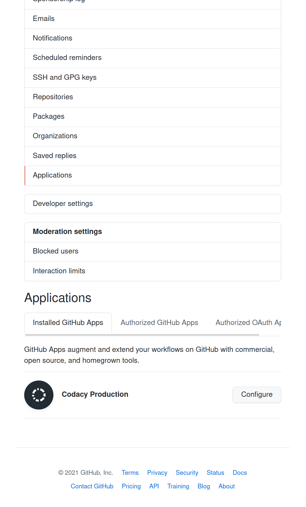
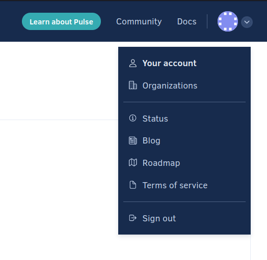
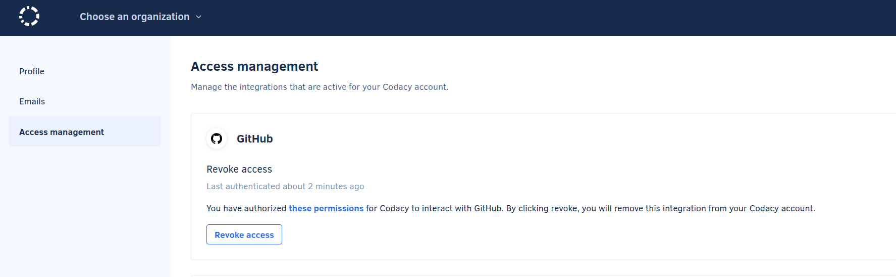
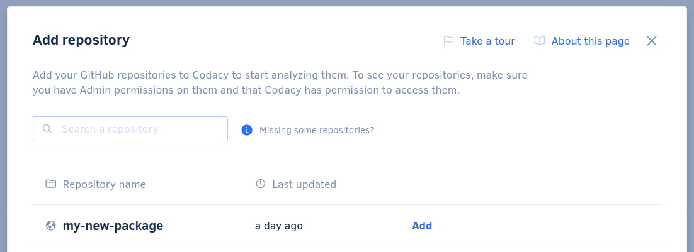

.. include:: /extras.rst.txt
.. highlight:: rst
.. index:: codacy-integration ; Index

.. _codacy-integration:
==================
Codacy Integration
==================

Codacy [1]_ is an automated code review tool that monitors your technical debt,
helps you improve your code quality, teaches best practices to developers,
and helps you save time in code reviews.

The GitHub integration incorporates Codacy into your existing Git workflows.

If Codacy is not precisely what you are looking for, see Stackshare_ for some
alternatives you may wish to explore.

.. [1] `From the Codacy documentation <https://github.com/codacy/docs>`_

.. _Stackshare: https://stackshare.io/codacy/alternatives

|

See a list of steps below to get your Codacy integration up
and running fast.

|

Pre-requisites
==============

A `GitHub <https://github.com/join>`_ account.

:ref:`Create a GitHub repository.<create-GH-repo>`

:ref:`Create a cookiecutter-py3-package.<cookie-create-pkg>`

.. _codacy-integration-tutorial:
Tutorial
========

.. important::

  The user that enables the Codacy integration must have administrator access
  to the repository. Codacy uses this GitHub user to suggest fixes on
  pull requests.

|

Create a Codacy Account
-----------------------

|

Visit `Codacy Sign Up Page <https://www.codacy.com/signup>`_ and click the
`GitHub` option.

Review the permissions you will provide Codacy Production to access you
repository.

If these meet your needs then click `Authorize Codacy Production`

|

Fill in the Codacy Questions.

|

Adding a new organisation.  Click `Install and authorize Codacy`.

|

Select where you want to install and authorise Codacy.

|

Select which of your repositories Codacy can access.

`All repositories` allow Codacy to access all repositories without any further
input from you.

`Only select repositories` requires further input from you and provides more
control over Codacy interaction with your GitHub repositories.

After reviewing this page and making your choice, click `Install & Authorize`.

|

Open your GitHub Account and navigate to Settings->Applications and
click `Configure`.

Here, you can check that your selected Codacy options have been implemented
correctly and make changes before final authorisation.

Click `Save` to complete the Codacy authorisation.

|

Sign back into Codacy and navigate to `Your Account` then `Access Management`.

|

Check GitHub has been succesfully authorised.

|

Go to `Choose an Organisation` and add your user.

Codacy will present you with a list of authorised repositories.

Click `Add` your new package.

Your new package will now appear in the Repositories list.

|

.. tip::

   After enabling this option, you can set Codacy as a required check before
   merging your pull requests.

   See :ref:`GitHub Protected Branches Tutorial<GH-protected-branches>`
   for more information.

.. admonition:: Need help with Codacy?

    See `Codacy Community <https://community.codacy.com/>`_ if you have
    questions or would like more information.

Whats next?
-----------

Check out our other :ref:`Tutorials<tutorial-index>` for more information on
how to get the most out of your cookiecutter package.
