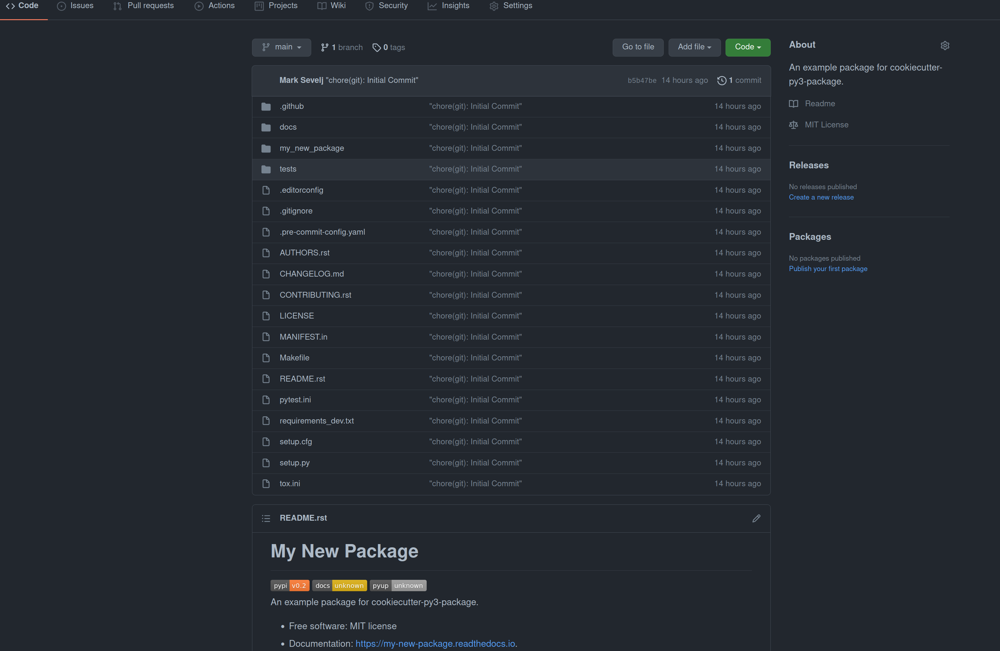

.. include:: /extras.rst.txt
.. highlight:: rst
.. index:: cookie-create-pkg ; Index

.. _create-first-git-push:
========================
Create GitHub First Push
========================

Pre-requisites
==============

A `GitHub <https://github.com/join>`_ account.

:ref:`Create a GitHub repository.<create-GH-repo>`

:ref:`Create a cookiecutter-py3-package.<cookie-create-pkg>`

.. _create-GH-repo-tutorial:
Tutorial
========

.. _git-CLI-push-options:
GitHub Local Repository CLI Push Options
----------------------------------------

After creating your GitHub repository and cookiecutter-py3-package,
you have several options to get your package initialised and pushed into
your repository.

.. important::

  Replace `imAsparky/my-new-package.git`
  with `<your-repo-name>/<your-package-name>.git`

+++++++++++++++++++++++++++++++++++++++++++++++++++++++++++++++++++++++++++++++

.. _git-CLI-push-default:
Using Default Settings
~~~~~~~~~~~~~~~~~~~~~~

If you have used the default package creation setting:

.. code-block:: bash

   automatic_set_up_git_and_initial_commit [y]:

|

Getting ready for your first push to GitHub is quite simple.

You will have a folder structure similar to this.

.. code-block::

    packages
        ├── my-new-package
        └── my_env

.. code-block::

    cd my-new-package

You will have a folder structure similar to this.

.. code-block::

    my-new-package
        ├── .git
        ├── .github
        ├── AUTHORS.rst
        ├── CHANGELOG.md
        ├── CONTRIBUTING.rst
        ├── LICENSE
        ├── MANIFEST.in
        ├── Makefile
        ├── README.rst
        ├── docs
        ├── my_new_package
        ├── pytest.ini
        ├── requirements_dev.txt
        ├── setup.cfg
        ├── setup.py
        ├── tests
        └── tox.ini

Check git status.

.. code-block::

        git status

You will see CLI output similar to this.

.. code-block::

    On branch main
    nothing to commit, working tree clean

Check git reflog.

.. code-block::

    git reflog

You will see CLI output similar to this.

Notice the commit message "chore(git): Initial Commit"

.. code-block::

    b5b47be (HEAD -> main) HEAD@{0}: commit (initial): "chore(git): Initial Commit"

Now you can push your new package to GitHub.

.. code-block::

    git push -u origin main

You will see CLI output similar to this.

.. code-block::

    Enumerating objects: 48, done.
    Counting objects: 100% (48/48), done.
    Compressing objects: 100% (40/40), done.
    Writing objects: 100% (48/48), 15.59 KiB | 939.00 KiB/s, done.
    Total 48 (delta 2), reused 0 (delta 0), pack-reused 0
    remote: Resolving deltas: 100% (2/2), done.
    To github.com:imAsparky/my-new-package.git
    * [new branch]      main -> main
    Branch 'main' set up to track remote branch 'main' from 'origin'.

Navigate to your GitHub my-new-package repository and it will look
something like this.

+++++++++++++++++++++++++++++++++++++++++++++++++++++++++++++++++++++++++++++++

.. _git-CLI-push-GIT-options:
GitHub Alternative Options
~~~~~~~~~~~~~~~~~~~~~~~~~~

Here are the other options provided by GitHub.

|

Quick setup — if you’ve done this kind of thing before.

.. tab:: HTTPS

    .. code-block:: bash

        git clone https://github.com/imAsparky/my-new-package.git

.. tab:: SSH

    .. code-block:: bash

        git clone git@github.com:imAsparky/my-new-package.git

.. code-block:: bash
    :caption: **…or create a new repository on the command line**

    git init
    git add -A
    git commit -m "chore(git): Initial Commit"
    git branch -M main
    git remote add origin git@github.com:imAsparky/my-new-package.git
    git push -u origin main

.. code-block:: bash
    :caption: **…or push an existing repository from the command line**

    git remote add origin git@github.com:imAsparky/my-new-package.git
    git branch -M main
    git push -u origin main

.. code-block:: bash
    :caption: **…or import code from another repository**

    This option is not supported here.

Whats next?
-----------

Check out our other :ref:`Tutorials<tutorial-index>` for more information on
how to get the most out of your cookiecutter package.
